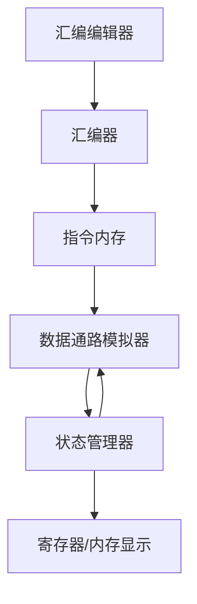

# RISC-V 模拟器架构文档

## 1. 系统架构概述

### 1.1 整体架构

本系统采用前端单页应用架构，主要分为以下几个核心层次：

1. **表现层**
   - 用户界面组件
   - 可视化数据通路
   - 交互控制面板

2. **业务逻辑层**
   - 汇编器模块
   - 指令执行引擎
   - 数据通路模拟器

3. **数据管理层**
   - 状态管理
   - 内存模拟
   - 寄存器管理

### 1.2 核心模块交互



## 2. 数据通路设计

### 2.1 基本数据通路

基本数据通路包含以下核心组件：

1. **PC（程序计数器）**
   - 功能：存储当前执行指令的地址
   - 更新逻辑：PC + 4 或跳转地址

2. **指令内存**
   - 功能：存储程序指令
   - 接口：根据PC读取指令

3. **寄存器文件**
   - 结构：32个通用寄存器
   - 接口：同时支持两个读端口和一个写端口

4. **ALU**
   - 功能：执行算术逻辑运算
   - 操作：加、减、与、或、异或等

5. **数据内存**
   - 功能：存储程序数据
   - 接口：支持字节、半字、字的读写

### 2.2 控制信号

主要控制信号包括：

1. **ALU控制**
   - ALUOp：指定ALU操作类型
   - ALUSrc：选择ALU第二个操作数来源

2. **内存控制**
   - MemRead：内存读使能
   - MemWrite：内存写使能
   - MemtoReg：选择写回数据来源

3. **寄存器控制**
   - RegWrite：寄存器写使能
   - RegDst：选择目标寄存器

## 3. 指令执行流程

### 3.1 基本执行周期

每条指令的执行都经过以下阶段：

1. **取指（IF）**
   ```typescript
   const fetchInstruction = (pc: number): number => {
     return instructionMemory[pc];
   };
   ```

2. **译码（ID）**
   ```typescript
   const decodeInstruction = (instruction: number) => {
     return {
       opcode: instruction & 0x7F,
       rd: (instruction >> 7) & 0x1F,
       funct3: (instruction >> 12) & 0x7,
       rs1: (instruction >> 15) & 0x1F,
       rs2: (instruction >> 20) & 0x1F,
       funct7: (instruction >> 25) & 0x7F
     };
   };
   ```

3. **执行（EX）**
   ```typescript
   const executeALU = (op1: number, op2: number, aluOp: number): number => {
     switch(aluOp) {
       case ALU_ADD: return op1 + op2;
       case ALU_SUB: return op1 - op2;
       // ... 其他操作
     }
   };
   ```

4. **访存（MEM）**
   ```typescript
   const memoryAccess = (address: number, writeData?: number): number => {
     if (writeData !== undefined) {
       dataMemory[address] = writeData;
     }
     return dataMemory[address];
   };
   ```

5. **写回（WB）**
   ```typescript
   const writeBack = (rd: number, data: number): void => {
     if (rd !== 0) { // x0 is constant 0
       registers[rd] = data;
     }
   };
   ```

### 3.2 指令类型处理

1. **R型指令**
   - 格式：`<op> rd, rs1, rs2`
   - 示例：`add x1, x2, x3`
   - 执行流程：读取两个源寄存器 → ALU运算 → 写回目标寄存器

2. **I型指令**
   - 格式：`<op> rd, rs1, imm`
   - 示例：`addi x1, x2, 5`
   - 执行流程：读取源寄存器和立即数 → ALU运算 → 写回目标寄存器

3. **S型指令**
   - 格式：`<op> rs2, imm(rs1)`
   - 示例：`sw x2, 4(x1)`
   - 执行流程：计算内存地址 → 读取源寄存器 → 写入内存

4. **B型指令**
   - 格式：`<op> rs1, rs2, offset`
   - 示例：`beq x1, x2, loop`
   - 执行流程：比较两个寄存器 → 根据结果更新PC

## 4. 状态管理设计

### 4.1 核心状态结构

```typescript
interface SimulatorState {
  // 数据通路状态
  nodes: ComponentNode[];
  edges: ConnectionEdge[];
  
  // 执行状态
  pc: number;
  instruction: number;
  isRunning: boolean;
  
  // 存储状态
  registers: number[];
  memory: Uint8Array;
  
  // 控制状态
  controlSignals: {
    aluOp: number;
    memRead: boolean;
    memWrite: boolean;
    regWrite: boolean;
    // ...
  };
}
```

### 4.2 状态更新流程

1. **指令执行状态更新**
   ```typescript
   const updateExecutionState = (state: SimulatorState) => {
     // 更新PC
     state.pc = calculateNextPC(state);
     
     // 更新指令
     state.instruction = fetchInstruction(state.pc);
     
     // 更新控制信号
     state.controlSignals = generateControlSignals(state.instruction);
   };
   ```

2. **数据通路状态更新**
   ```typescript
   const updateDatapathState = (state: SimulatorState) => {
     // 更新节点值
     state.nodes = state.nodes.map(node => ({
       ...node,
       data: calculateNodeValue(node, state)
     }));
     
     // 更新连线状态
     state.edges = state.edges.map(edge => ({
       ...edge,
       animated: isDataFlowing(edge, state)
     }));
   };
   ```

## 5. 性能优化

### 5.1 渲染优化

1. **组件缓存**
   ```typescript
   const DatapathNode = React.memo(({ data, selected }) => {
     // 只在必要时重渲染
     return (
       <div className={selected ? 'selected' : ''}>
         {data.label}
       </div>
     );
   });
   ```

2. **状态分割**
   ```typescript
   const useSimulationStore = create<SimulationState>()(set => ({
     // 将模拟状态与UI状态分开
     simulation: { ... },
     ui: { ... }
   }));
   ```

### 5.2 计算优化

1. **缓存计算结果**
   ```typescript
   const memoizedCalculation = useMemo(() => {
     return heavyComputation(props.value);
   }, [props.value]);
   ```

2. **批量更新**
   ```typescript
   const batchUpdate = (changes: StateChange[]) => {
     useSimulatorStore.setState(state => {
       // 一次性应用所有更改
       return applyChanges(changes, state);
     });
   };
   ```

## 6. 扩展性设计

### 6.1 指令集扩展

系统设计支持通过以下方式扩展指令集：

1. **新增指令类型**
   ```typescript
   interface CustomInstruction extends BaseInstruction {
     type: 'CUSTOM';
     // 自定义字段
   }
   ```

2. **扩展ALU操作**
   ```typescript
   const extendedALUOps = {
     ...baseALUOps,
     CUSTOM_OP: (a: number, b: number) => {
       // 自定义运算
     }
   };
   ```

### 6.2 组件扩展

支持通过以下方式添加新的数据通路组件：

1. **自定义节点组件**
   ```typescript
   const CustomComponent = ({ data }: NodeProps) => {
     // 实现自定义组件逻辑
     return (
       <div className="custom-component">
         {/* 组件内容 */}
       </div>
     );
   };
   ```

2. **注册新组件**
   ```typescript
   const nodeTypes = {
     ...baseNodeTypes,
     customNode: CustomComponent
   };
   ```

## 7. 调试功能

### 7.1 状态监控

1. **寄存器监视**
   ```typescript
   const RegisterMonitor = () => {
     const registers = useSimulatorStore(state => state.registers);
     return (
       <div className="register-monitor">
         {registers.map((value, index) => (
           <div key={index}>
             x{index}: {value}
           </div>
         ))}
       </div>
     );
   };
   ```

2. **数据通路可视化**
   ```typescript
   const DatapathVisualizer = () => {
     const nodes = useSimulatorStore(state => state.nodes);
     const edges = useSimulatorStore(state => state.edges);
     
     return (
       <ReactFlow
         nodes={nodes}
         edges={edges}
         nodeTypes={nodeTypes}
       />
     );
   };
   ```

### 7.2 执行控制

1. **单步执行**
   ```typescript
   const stepExecution = () => {
     useSimulatorStore.setState(state => ({
       ...state,
       ...executeOneInstruction(state)
     }));
   };
   ```

2. **断点设置**
   ```typescript
   const setBreakpoint = (address: number) => {
     useSimulatorStore.setState(state => ({
       ...state,
       breakpoints: [...state.breakpoints, address]
     }));
   };
   ```

## 8. 错误处理

### 8.1 运行时错误处理

1. **指令执行错误**
   ```typescript
   const executeInstruction = (state: SimulatorState) => {
     try {
       // 执行指令
       return newState;
     } catch (error) {
       handleExecutionError(error);
       return state;
     }
   };
   ```

2. **内存访问错误**
   ```typescript
   const accessMemory = (address: number) => {
     if (address < 0 || address >= MEMORY_SIZE) {
       throw new MemoryAccessError(address);
     }
     return memory[address];
   };
   ```

### 8.2 编译错误处理

1. **语法错误检查**
   ```typescript
   const validateInstruction = (instruction: string) => {
     const errors = [];
     // 检查指令格式
     if (!INSTRUCTION_REGEX.test(instruction)) {
       errors.push(new SyntaxError(instruction));
     }
     return errors;
   };
   ```

2. **错误报告**
   ```typescript
   const reportError = (error: CompileError) => {
     return {
       line: error.line,
       column: error.column,
       message: error.message,
       severity: error.severity
     };
   };
   ```